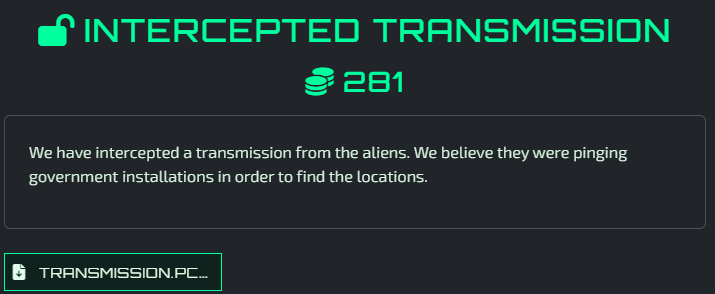
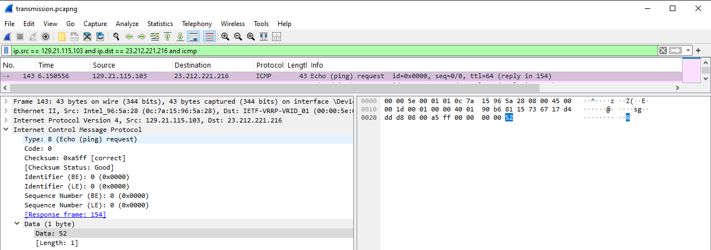
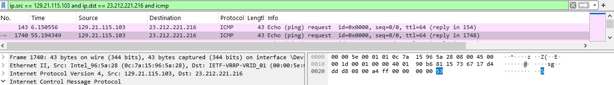
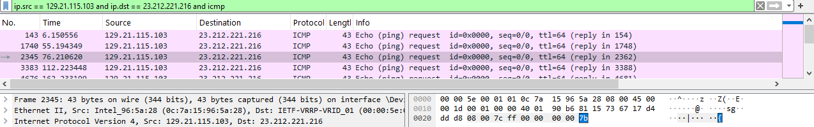

# Intercepted Transmission - Solved


[pcap download](./Media/transmission.pcapng)

For this challenge, it seemed the focus was on ping traffic (aka ICMP).

Upon opening the pcap in Wireshark, I noticed the ICMP packets had letters in the ICMP Data fields.

Knowing this challenge used a flag format of RS{}, I could see right away that the first couple of ICMP requests formed "RS{" in their Data fields.

I applied a filter of ```ip.src == 129.21.115.103 and ip.dst == 23.212.221.216 and icmp``` to isolate the icmp request packats that had Data.

Once this was done, I manually pieced together the flag as there were now only 17 packets.

Flag: ```RS{Its A Coverup}```




