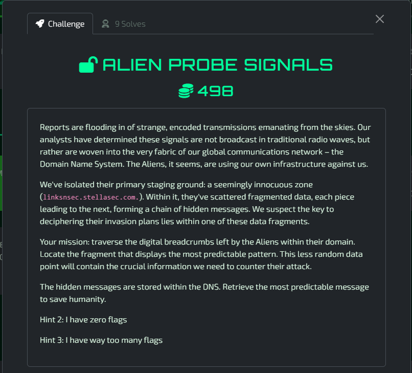
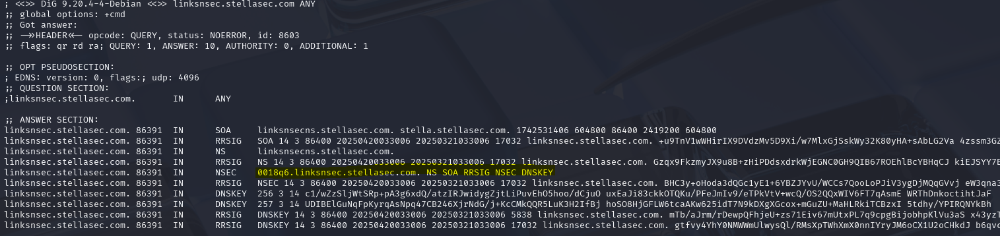
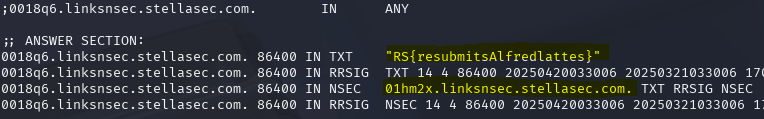
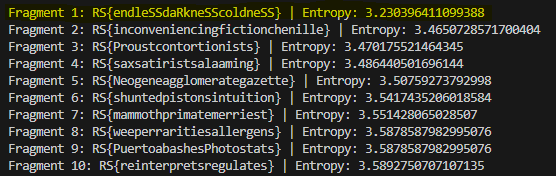

# Alien Probe Signals - Solved

#### 4th solve / only 9 solves



As mentioned in the description, were are looking at DNS for this challenge. The "Aliens" have scattered fragmented data across this chain, with one of them being the key to the challenge.

Upon running an ANY lookup on the domain using ```dig linksnsec.stellasec.com ANY``` I see the following results:



From this result I can see DNSSEC is being used, with less secure NSEC entries rather than NSEC3. This opens up enumeration of the domain by allowing you to see surrounding subdomains and follow this trail. I have since learned this is called ```Zone Walking```

### Subdomain Enumeration
After querying the ```0018c6.linksnsec.stellasec.com``` subdomain, I can see that there is a TXT record with a fragment of the data (or flag) and another NSEC record showing the next surrounding subdomain. 



I then created a script to loop through this process. Collecting the data fragment from the TXT fragment, pulling the NSEC record, using dig on it, rinse and repeat.

Originally this led to ~350 results, which later turned out to be an incomplete dataset due to a script issue. This led to an hour or two wasted using bad data. In the end, there were 477 results.

[digloop.py](./assets/digloop.py)
[fragments.txt](./assets/fragments.txt)

Now that I had all the fragments, I had to focus on locating the "fragment that displays the most predictable pattern" and "less random". These key words made me think of Entropy, which was later confirmed by a hint they released for this challenge.

I created another script to calculate the entropy of each data fragment using a common method (Shannon Entropy). This would give me the fragment with the lowest entropy value, aka the most predictable fragment!

[entropy.py](./assets/entropy.py)

This process was hindered by testing without the RS{} wrapper, with the wrapper, and realizing I had a bad dataset. Eventually once I had the full dataset and including the RS{} wrapper, the script output the following:




Flag: ```RS{endleSSdaRkneSScoldneSS}```